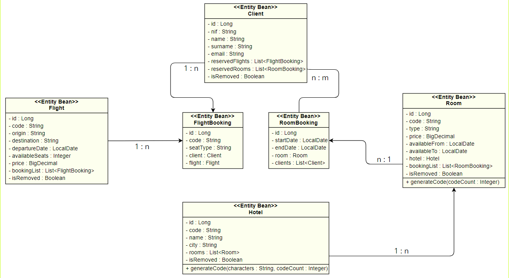

# PRUEBA TÉCNICA 4
Hack A Boss - Softtek

Aaron Manuel Fernández Mourelle

## DESCRIPCIÓN
API desarrollada para poner a prueba lo aprendido durante este bootcamp (Git, Java, Spring Boot, Testing, JPA + Hibernate, Spring Security).

## 🔧REQUISITOS
- IDE con soporte a Java.
- Java 17 o superior.
- Gestor de bases de datos con MySQL.
- Base de datos de nombre `agencia`.
- Ejecutar el script `agency_dump.sql` si se desea iniciar el programa con datos de prueba sobre: Hoteles, Habitaciones, Vuelos, Clientes.
- Postman si se desea obtener la colección exportada.

### 🔐SEGURIDAD
Spring Security con Basic Auth. Para poder realizar operaciones sobre los endpoint restringidos:
- Usuario: `admin`
- Contraseña: `abc123.`

## 📖DOCUMENTACIÓN
Ruta de acceso a Swagger: http://localhost:8080/doc/swagger-ui.html.

Proporcionado también una colección de Postman `Agencia Turismo (AaronFMPT4)` con ejemplos de requests.

### DIAGRAMA UML

### ESTRUCTURA DEL PROYECTO
- Config: Guarda la configuración de Spring Security.
- Controller: Maneja y valida las request del usuario.
- DTO: Contiene los modelos Data Transfer Object, tanto para requests como para responses.
- Model: Contiene las clases entidad del modelo.
- Repository: Contiene los métodos para la capa de datos.
- Service: Contiene la lógica de negocio e intermedia entre el repositorio y el controlador.

## 💭SUPUESTOS
- Se ha implementado un método de persistencia para clientes a modo de cascada. No se ha considerado la necesidad de un CRUD  completo para esta tabla.
  - Esto se ha decidido considerando que el enfoque principal de la API es sobre el registro de reservas y contenedores de las mismas (vuelos y habitaciones).
- Para la reserva de habitaciones, se permite guardar un listado de quienes estarán en dicha reserva.
- Se aplica borrado lógico sobre las entidades principales (hotel, habitación, vuelo) y borrado físico sobre las reservas.
- Se verifica la disponibilidad de una habitación en base a sus fechas de disponibilidad y reservas realizadas.
- El campo de asientos disponibles se actualizará con el alta y baja de las diferentes reservas de vuelo.

#### Código
- El manejo de excepciones y validaciones se ha delegado a un `ControllerAdvice` a fin de reutilizar y simplificar código de las clases `controller`.
- Se utilizan DTOs tanto para las solicitudes como para las respuestas, pasando las solicitudes sobre dos criterios de validación según el endpoint llamado:
  - `OnCreate`: Validación de datos más estricta para las operaciones de alta.
  - `OnUpdate`: Validación suave para permitir flexibilidad a la hora de actualizar contenido.
- Las validaciones se han realizado principalmente mediante Jakarda Validation Constraints.
