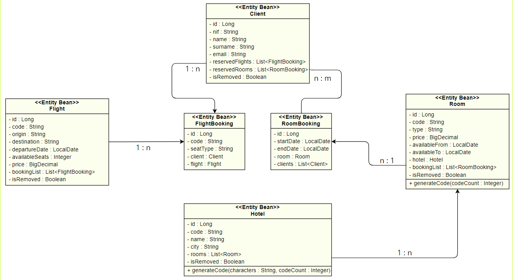

[![Button Example]][Link]

[Link]: READ_ME_en.md

[Button Example]: https://img.shields.io/badge/README:%20Spanish-CD3939?style=for-the-badge

# TECHNICAL TEST 4
Hack A Boss - Softtek

Aaron Manuel Fernández Mourelle

## DESCRIPTION
API developed to test the knowledge acquired during this bootcamp (Git, Java, Spring Boot, Testing, JPA + Hibernate, Spring Security).

## 🔧REQUIREMENTS
- IDE with Java support.
- Java 17 or higher.
- Database management system with MySQL.
- Database named `agency`.
- Execute the `agency_dump.sql` script if you wish to start the program with sample data for: Hotels, Rooms, Flights, Customers.
- Postman if you wish to obtain the exported collection.

### 🔐SECURITY
Spring Security with Basic Auth. To perform operations on restricted endpoints:
- Username: `admin`
- Password: `abc123.`

## 📖DOCUMENTATION
Swagger access route: http://localhost:8080/doc/swagger-ui.html.

Also provided a Postman collection `Tourism Agency (AaronFMPT4)` with request examples.

### UML DIAGRAM

### PROJECT STRUCTURE
- `Config` Saves the Spring Security configuration.
- `Controller` Handles and validates user requests.
- `DTO` Contains Data Transfer Object models, both for requests and responses.
- `Model` Contains the entity classes of the model.
- `Repository` Contains methods for the data layer.
- `Service` Contains the business logic and intermediates between the repository and the controller.

## 💭ASSUMPTIONS
- A persistence method for customers has been implemented as cascade mode. The need for a complete CRUD for this table has not been considered.
  - This decision was made considering that the main focus of the API is on registering reservations and containers of them (flights and rooms).
- For room reservation, it is allowed to save a list of individuals who will be in that reservation.
- Logical deletion is applied to the main entities (hotel, room, flight) and physical deletion to the reservations.
- The availability of a room is checked based on its availability dates and reservations made.
- The available seats field will be updated with the addition and removal of different flight reservations.

#### Code
- Exception handling and validations have been delegated to a `ControllerAdvice` in order to reuse and simplify code from the `controller` classes.
- DTOs are used for both requests and responses, passing requests through two validation criteria depending on the called endpoint:
  - `OnCreate`: Stricter data validation for create operations.
  - `OnUpdate`: Soft validation to allow flexibility when updating content.
- Validations have been mainly performed using Jakarta Validation Constraints.
